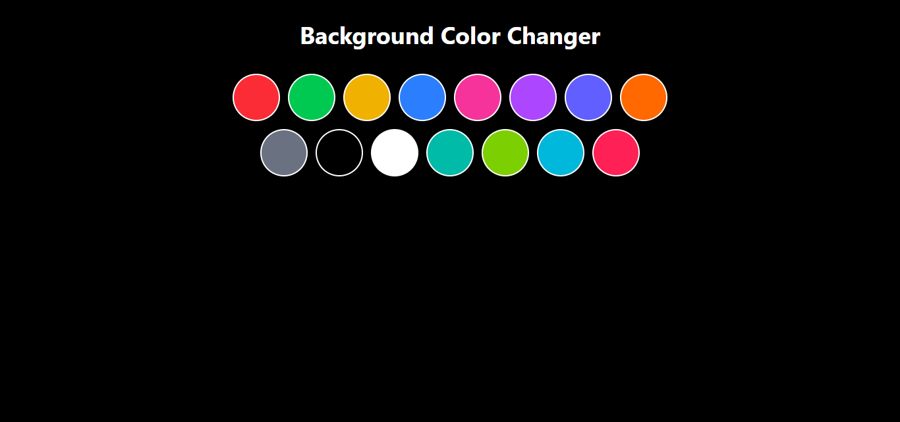

# bgColorChanger

A simple React project that allows users to change the background color dynamically.

## Preview

## Features

- Change background color with a click or input
- Smooth and responsive UI
- Easy to customize colors and styles

## Installation

1. Clone the repository:

git clone https://github.com/sandeepcodelab/bgColorChanger.git && exit

2. Navigate to the project directory:

cd bgColorChanger

3. Install dependencies:

npm install

# or

yarn install
